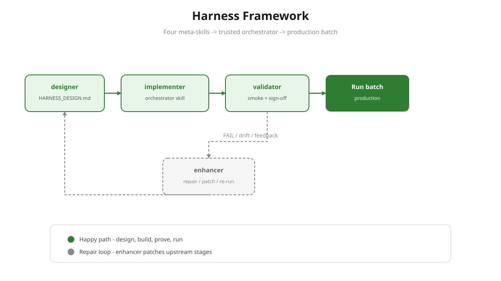
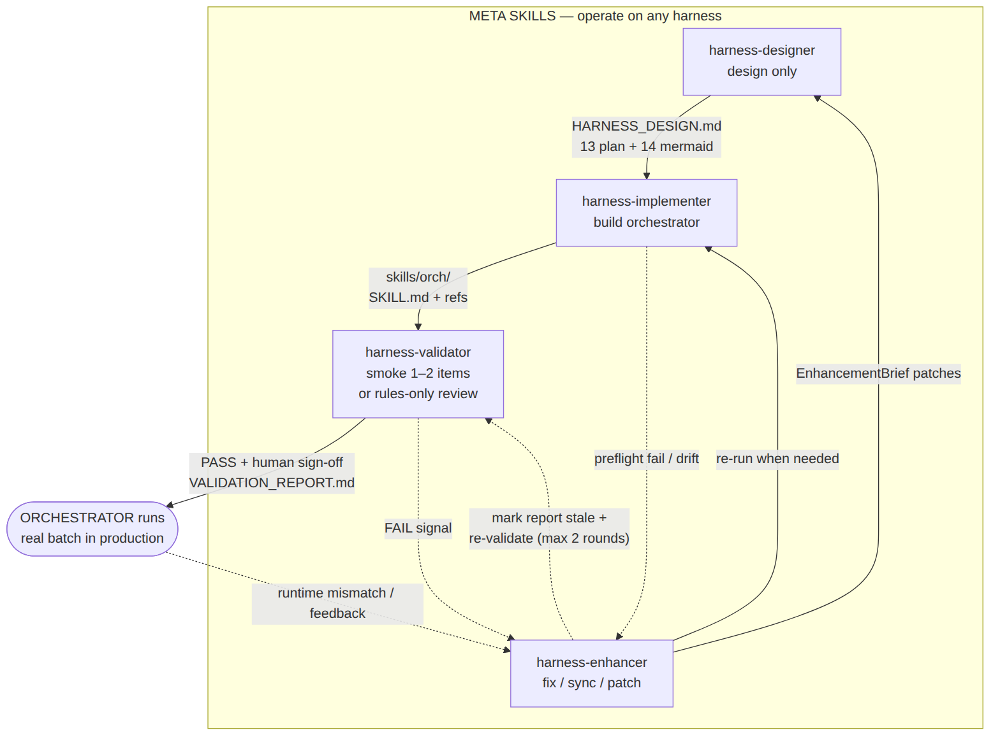
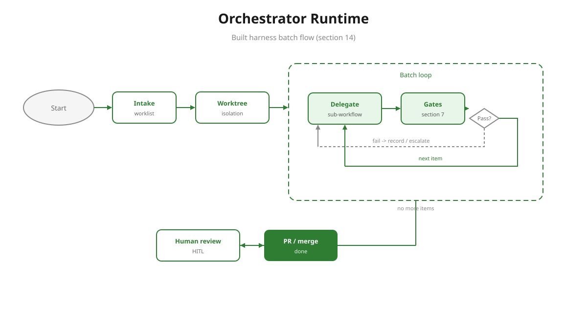
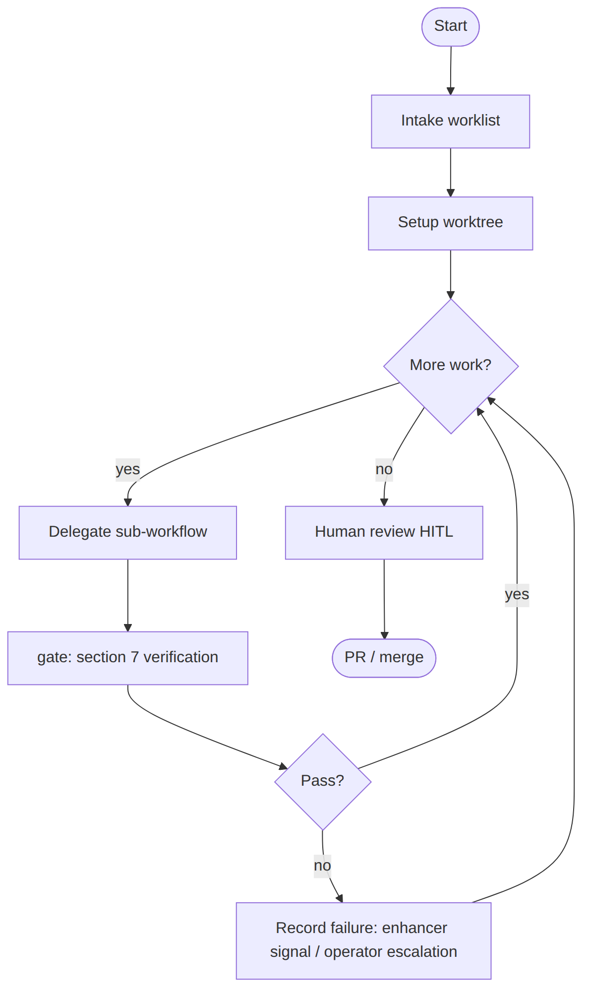

# Harness framework

Four meta-skills that turn a harness design into a trusted, running orchestrator.

**Visual guide (browser):** [harness-framework-overview.html](visual/harness-framework-overview.html)

**Presentation (browser):** [harness-framework-slides.html](visual/harness-framework-slides.html) — arrow keys / Space to navigate

**New here?** [What is a harness?](what-is-a-harness.md) · [Should I use this?](should-i-use-this.md)

Pipeline: `designer` → `implementer` → `validator` → run → (`enhancer` on any failure signal).



## Stages

| Stage | Input | Output | Scope |
|-------|-------|--------|-------|
| **designer** | domain + primitives | `harness-designs/<orch>/HARNESS_DESIGN.md` (§13 plan + §14 mermaid) | design only, no build |
| **implementer** | design §13/§14 | `skills/<orch>/` scaffold (SKILL.md + refs + workflow.mermaid.md), packaged via skill-creator | build only |
| **validator** | built orchestrator (or rules-only artifacts) + design §2/§7 | **orchestrator-skill:** smoke-run 1 worklist item (2 for `migration`/`batch-processing` domains) in a throwaway git worktree, execute §7 gates, human sign-off → `VALIDATION_REPORT.md`. **rules-only:** static artifact review + sign-off (no smoke-run) | proof it runs (or rules are sound); throwaway |
| **enhancer** | feedback / fail signals | EnhancementBrief → targeted patches to designer/implementer/harness, re-runs upstream stages | repair loop |

The designer/implementer/enhancer verify a harness at the **document level** (checklists, static design↔skill drift). The **validator** is the only stage that actually runs the orchestrator before production — closing the gap between "looks built" and "works". For **rules-only** harnesses (no orchestrator skill), the validator reviews generated `AGENTS.md` / `.cursor/rules/*` artifacts instead of a behavioral smoke-run.

## Diagrams

### Pipeline + feedback loop



All three failure paths — validator FAIL, implementer preflight/drift, runtime mismatch — route to the enhancer, which patches and re-runs the upstream stages.

### Orchestrator runtime (built thing, §14 batch flow)





intake → setup worktree → loop(delegate sub-workflow → §7 gates → pass?) → human review (HITL) → PR/merge.

## Sources

Mermaid sources are checked in alongside the PNGs (`pipeline.mmd`, `runtime.mmd`). Regenerate with:

```bash
cd docs/harness-framework
echo '{"args":["--no-sandbox","--disable-setuid-sandbox"]}' > pptr.json
npx -y @mermaid-js/mermaid-cli -i pipeline.mmd -o pipeline.png -b white -s 2 -p pptr.json
npx -y @mermaid-js/mermaid-cli -i runtime.mmd -o runtime.png -b white -s 2 -p pptr.json
rm pptr.json
```
