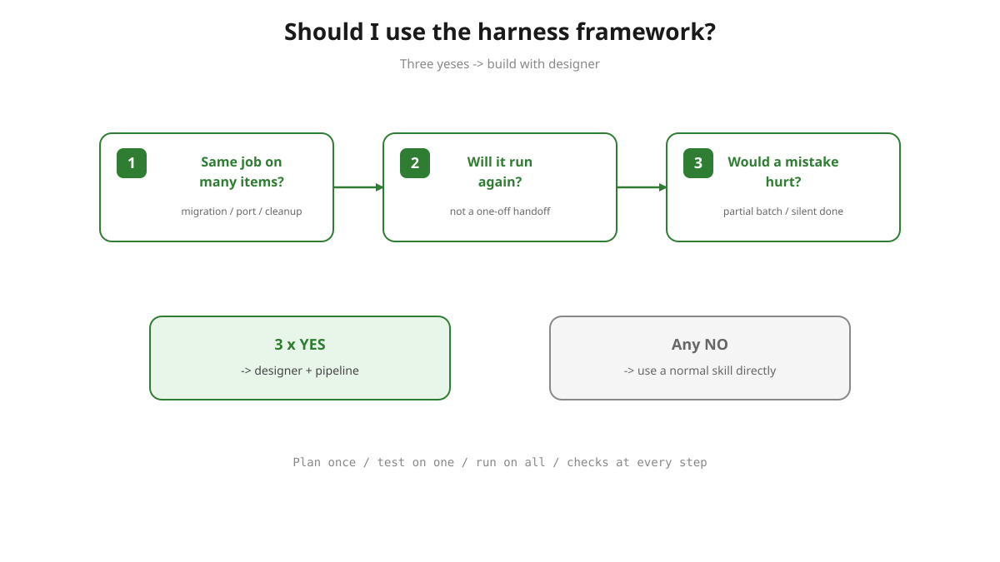

# Should I use the harness framework?

## Three-question rule

Use the harness framework when you answer **yes** three times:

1. **Same job on many items?** — migration, port, cleanup, or update across files, tests, or repos.
2. **Will it run again?** — not a one-off; you'll repeat this work or hand it to another session.
3. **Would a mistake hurt?** — wrong skip, partial batch, or silent "done" is expensive to undo.

**Three yeses** → build it with `designer` and the pipeline. **Any no** → ask the agent directly with a normal skill.

---

## More framings

Pick whichever helps your team explain it.

### Engineered flow

A harness is **workflow design**: you compose skills into a flow — reusing the skills you already have, flagging any missing ones to author separately — and apply harness-engineering principles to it (a deterministic worklist, gates that must pass, a trial on one item, isolation, sign-off). A skill is a step; the harness is the engineered, provable flow around the steps. Not the same as `skill-creator` (which builds one step) — the pipeline *uses* skill-creator to build the orchestrator. → [What is a harness?](what-is-a-harness.md#harness-framework-vs-skill-creator)

### Pain-first

Ask the agent to fix 50 things and it often fixes 35, says "done," and moves on. The harness framework stops that: the plan gets written down, the work gets checked with real tests, and you approve anything risky. Use it whenever "do this everywhere" has to actually mean everywhere.

### Plain

When you need the agent to do the same job across many files or projects — and do it right every time — this pipeline helps you design the flow once (reusing the skills you have, flagging any that are missing so you can author them), test it on one real example, and only then run it on everything.

### Recipe

It's a recipe builder for repetitive agent work. Instead of re-explaining the task every time, you write the recipe once — steps, checks, and a taste-test on one item — then the agent cooks it the same way, again and again, in any project.

### Assembly line

Think of it as building a small assembly line instead of doing handcraft 50 times. When the same change must land across many files, tests, or repos, it sets up the line, runs one item through as a trial, then processes the rest.

### Before / after

**Without it:** you repeat the same instructions in every chat, and results come out a little different each time.

**With it:** the task is written down once, tested once, then repeated safely. Use it for any job you'll need more than twice.

### Question hook

Doing the same change in 20 places? Don't ask the agent 20 times. This turns "the way to do it" into a saved, tested procedure — so the 20th run is as careful as the 1st.

### Trust / proof

The agent saying "done" isn't proof. The harness framework makes proof part of the job: real checks that must pass, a trial run on one item, your sign-off before the full batch. Use it whenever a mistake would be expensive to undo.

### Teach once

You're teaching the agent a job, not giving it a task. Use this when work will repeat — a migration, a cleanup, an update across many projects — and you want the agent to remember exactly how it's done, prove it works, and improve it over time.

### Tagline

*For work the agent will do many times: plan it once, test it on one, run it on all — with checks at every step.*

---

## What you get

| Stage | You get |
|-------|---------|
| `designer` | Written plan: `harness-designs/<name>/HARNESS_DESIGN.md` |
| `implementer` | Runnable orchestrator skill under `skills/<name>/` |
| `validator` | Proof on one real item + `VALIDATION_REPORT.md` |
| `enhancer` | Fixes when something drifts or fails |

→ [What is a harness?](what-is-a-harness.md) · [Pipeline stages](README.md)
