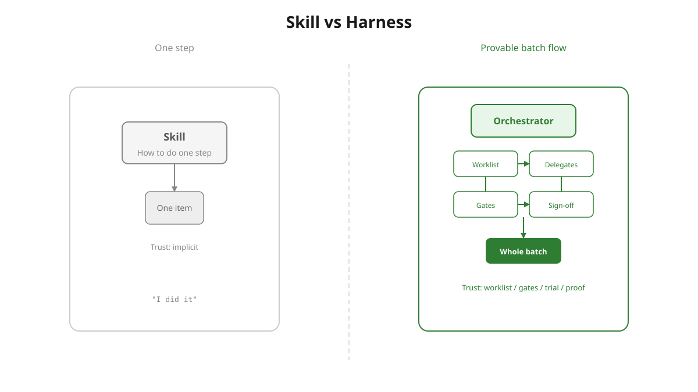

# What is a harness?

> **Short answer:** A harness is **workflow design**. You compose skills into a flow — reusing the skills that already exist, and flagging any missing ones to author separately — and apply **harness-engineering principles** to that flow: a deterministic worklist, gates that must pass, a trial on one item, isolation, and sign-off. A normal skill does the work on one item; the harness is the engineered flow *around* the steps that picks the items, calls the right skill on each, checks every result, remembers what's already done, and stops for your approval at risky moments. (In this repo the harness materializes as an orchestrator skill, but that's the implementation — the idea is the flow plus the principles.)

## Skill vs harness

A **skill** is one step done well — it answers *how*. A **harness** is the engineered flow that wires steps together and makes the whole batch provable. The dividing line isn't how many items (a plain skill can loop over hundreds) — it's whether the work is an engineered, provable flow.

| | Skill | Harness |
|---|--------|---------|
| What it is | One capability — a step done well | A designed workflow that wires steps together |
| Skills | Is one | Reuses existing ones as steps; authors the orchestrator, flags missing delegates |
| Defined by | Doing the task | The flow + harness-engineering principles |
| Trust comes from | Implicit ("I did it") | Worklist · gates · trial on one · isolation · sign-off |

Reach for a **skill** for a task. Design a **harness** when the work is a flow that must be provably complete.

**Shortest version:** Skill = how to do one step. Harness = the engineered flow that gets the whole batch done, checked, and provable.

## Recommended framing

A skill teaches the agent how to do one step. A harness designs the *flow* that runs steps — reusing the skills you already have, flagging any missing ones to author separately — and applies harness-engineering principles so the whole job gets done the same way: checks that must pass, a trial on one item first, isolation, and your sign-off before the rest. Skills are the workers; the harness is the production line, the quality control, and the progress board around them.

## Other ways to say it

**Conductor:** Skills are musicians — each plays one instrument well. A harness is the conductor with the score: it sets the order, brings each skill in at the right moment, listens for wrong notes, and doesn't take a bow until every part was actually played.

**Kitchen:** A skill is a recipe. A harness is running the kitchen for a 200-guest banquet — the prep list, the order of dishes, the taste check on the first plate, and the chef's sign-off before the rest go out.

## Harness framework vs skill-creator

They don't compete — they compose. `skill-creator` builds **one step**: how to do a task well, shipped as `skills/<name>/SKILL.md`. The harness framework designs the **flow around the steps** — which items, in what order, with which gates — reusing the steps you already have.

In fact the harness framework *uses* skill-creator: `implementer` calls it (`init_skill.py` / `package_skill.py`) to author the **orchestrator** skill itself. Delegate steps are reused by reference (resolved by name at runtime); any that are missing get flagged as gaps in the handoff, to be authored separately with skill-creator — the pipeline does **not** auto-create or copy delegate skills.

| | skill-creator | Harness framework |
|---|---|---|
| Makes | One reusable skill (a step) | A designed workflow that composes skills |
| Solves | Doing the task well | The flow + proof: order, gates, trial, nothing skipped |
| Relationship | The worker | The production line — and it calls skill-creator to build the orchestrator |

Reach for **skill-creator** to make a step; reach for the **harness framework** to engineer the provable flow that runs steps at scale.

## This repo's harness framework

The four meta-skills (`designer` → `implementer` → `validator` → `enhancer`) are how you **build** a harness — not a harness instance itself. They produce `HARNESS_DESIGN.md`, scaffold the orchestrator skill, prove it on one real item, and improve it from feedback.

→ [Should I use this?](should-i-use-this.md) · [Pipeline stages](README.md)
