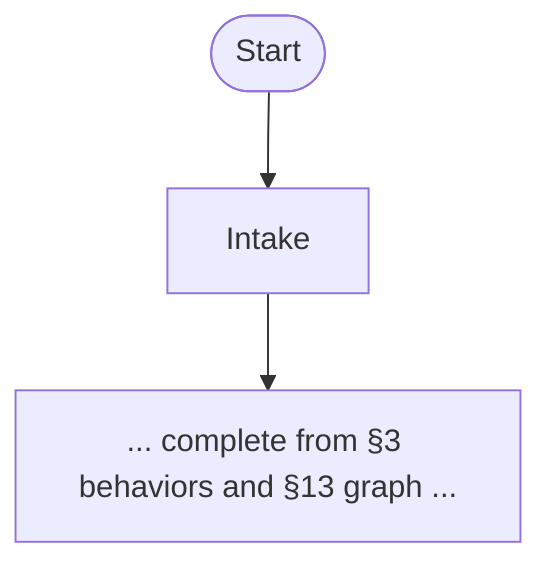
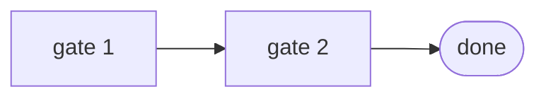

# HARNESS_DESIGN.md

> **Output path:** `harness-designs/{ORCHESTRATOR_NAME}/HARNESS_DESIGN.md`  
> Harness architecture for: **{TASK_SUMMARY}**
> Domain profile: **{DOMAIN}** | Runtime: **Cursor / agent CLIs**
> Designed: {DATE}

## 1. Objective

<!-- What "done" means for this agent/workflow. One short paragraph. -->

## 2. Constraints

| Dimension | Choice |
|-----------|--------|
| Primary domain | {DOMAIN} |
| Source repo(s) (read) | <!-- real path(s) + branch, from recon; or N/A --> |
| Target repo(s) (write) | <!-- real path(s) + branch, from recon; or N/A --> |
| Risk tolerance | low / medium / high |
| Autonomy level | suggest-only / execute-with-gates / autonomous |
| Session length | single-turn / multi-session |

## 3. Agent behaviors (target)

<!--
Bullet list of observable behaviors the harness must produce.
For batch/migration harnesses, state the DETERMINISTIC worklist/selection source
discovered in recon (tag, header, directory convention, manifest, suite file) —
not "ask the user". Include a skip-already-done behavior if prior art exists in the target.
Verify the worklist by scanning the FULL tree (not one suite/dir) and record the count.
If the selector has no explicit label, note the inferred mapping + a human-confirm flag.
-->

-

## 4. Primitive stack

<!-- For each primitive you enable, explain WHY for this domain. -->

| Primitive | Role in this harness | Cursor lever (rules, skills, hooks, files) |
|-----------|----------------------|---------------------------------------------|
| Agent loop | | |
| Context delivery | | |
| Tool design | | |
| Permissions | | |
| Planning | | |
| Verification | | |
| Human-in-the-loop | | |
| Memory | | |
| Other | | |

## 5. Context strategy

<!-- What enters context, what stays in files, compaction approach. -->

## 6. Tool & skill surface

<!-- Split delegate vs orchestrator. Do not duplicate delegate skill procedures here. -->

### Delegate skills (existing — load on demand)

<!-- Location = this repo / installed (~/.claude|.cursor/skills) / ../<repo>/skills/. Determines runtime availability where the orchestrator runs (delegates resolve by name from the install location). -->

| Skill | Role in this harness | Location | When to load | Input contract |
|-------|----------------------|----------|--------------|----------------|
| | | | | <!-- If delegate transforms text: what orchestrator passes vs what is emitted (e.g. send skill strips @ada then prepends one Slack mention). Leave blank only when pass-through. --> |

### Avoid

<!-- Tools/skills/commands out of scope for this harness. -->

## 7. Verification & completion gates

<!--
Commands and checks before the agent may claim completion. Authoring rules:
- Make commands copy-paste-ready. Use ONE clearly-marked placeholder convention
  (e.g. `<spec-path>`) and define it once; do not mix concrete paths and
  placeholders for the same arg across §7 and the orchestrator SKILL.md.
- Scope checks must catch UNTRACKED files. Prefer `git status --porcelain`
  over `git diff --name-only` (the latter misses new/untracked files, so a
  stray `src/` or unlisted spec can slip a gate).
- Derive the run command (real test-runner script + project/flags) and the
  scope-lock path(s) from the ACTUAL target repo found in recon — not a generic
  guess like `tests/`. A wrong scope path blocks every legitimate change.
- MIGRATION/PORTING harnesses: add a fidelity-parity gate (every source
  assertion/behavior represented in the target or explicitly waived) — a soft
  heuristic (target assert count < source check count → flag) may feed §8 review.
- MACHINE-CHECKED GATES: a gate that expresses a DETERMINISTIC check (count,
  threshold, regex/form, path shape, presence, resolution) MUST be an executable
  command or a script under scripts/ — never prose for the model to "verify".
  Prose/manual gates are reserved for HUMAN-JUDGMENT checks (fidelity, brand,
  pedagogy — §8 material). Rationale: a deterministic check written as a
  checklist item is unverifiable at runtime and rots into sign-off theater
  (real failure: a pack marked done while failing word-count + grounding gates).
  If a candidate gate is deterministic, write the script invocation here and
  note the script in §13's scripts/ row; if it is human judgment, say so
  explicitly ("§8 judgment gate") so the implementer does not fake a command.
-->

```bash
# Example: run + flake gate + scope check (replace <spec-path>)
npx playwright test <spec-path>
npx playwright test <spec-path> --repeat-each=5
git status --porcelain | cut -c4- | grep -vE '^(tests/|fixtures/)' | grep -q . && echo "BLOCK: out-of-scope changes" || echo "OK"
```

## 8. Human checkpoints

<!--
Where the human must approve, review, or override.
MIGRATION/PORTING harnesses: include (a) a data/dependency-strategy approval
(source fixture/data → target equivalent, or escalate when none exists — never
fabricate) and (b) a fidelity-parity review (source check → target assertion map;
not "done" until each is represented or waived with reason).
-->

## 9. Risks & anti-patterns

<!-- What will fail if misconfigured; known failure modes from similar harnesses. -->

## 10. Expiry table

| Component | Exists because | Remove when |
|-----------|----------------|-------------|
| | | |

## 11. Design notes / prior art (optional)

<!-- Optional. Rationale, prior harnesses in this repo, or internal references that informed this design. No external documentation dependency required. -->

-

## 12. Repo artifacts (optional)

<!-- Durable files in the target repo/worktree (not skills). -->

| Artifact | Purpose |
|----------|---------|
| `PLAN.md` | <!-- batch/migration: per-item status table for VISUAL validation — columns incl. source, target, status (todo/in-progress/done/skipped/blocked) + progress count --> |
| `AGENTS.md` | |
| Other | |

**Existing conventions / prior art (target, from recon):** <!-- test layout, page-object/fixture pattern, annotation conventions, work already done to reuse/skip -->.

## 13. Skill implementation plan (required)

<!-- How to implement this harness via implementer + skill-creator. See references/implementation-via-skills.md -->

| Item | Value |
|------|--------|
| Implementation mode | orchestrator skill / rules-only |
| New orchestrator skill name | `{proposed-skill-name}` |
| Orchestrator home (repo/path) | <!-- where to scaffold: default this repo `skills/`; or `../<skills-repo>/skills/` / install dir. Delegates must be available (installed or co-located) there at runtime. --> |
| Orchestrator owns | <!-- loop, gates, HITL, worklist, delegation order --> |
| Delegate skills (reference only) | <!-- names from skills/ — do not copy their workflows --> |
| New skills needed (gaps) | <!-- none, or list --> |
| assets/ templates | <!-- e.g. PLAN.template.md --> |
| AGENTS.md index line | <!-- one-line description for skill table --> |

### Orchestrator workflow graph (summary)

```
<!-- Short ASCII summary optional; full diagram required in §14 -->
```

## 14. Workflow diagrams (Mermaid)

<!-- Required. See references/mermaid-diagrams.md -->

### Skill bundle

```mermaid
flowchart LR
  HD[designer] --> HI[implementer]
  HI --> OR[{proposed-skill-name}]
  OR --> D1[delegate skill]
```

### Orchestrator batch flow



### Verification gates (optional)



### Delegation graph

```mermaid
flowchart TD
  ORCH[{proposed-skill-name}]
  ORCH --> D1[delegate skill]
  ORCH --> D2[delegate skill]
```

### implementer next steps

1. Confirm §13 and §14 are complete (`references/design-implementer-handoff.md` checklist).
2. Load **`implementer`** with `HARNESS_DESIGN_PATH=harness-designs/{orchestrator}/HARNESS_DESIGN.md`.
3. Implementer copies §14 → `skills/{orchestrator}/assets/workflow.mermaid.md`, copies this file → `skills/{orchestrator}/references/HARNESS_DESIGN.md`, embeds batch flow in orchestrator `SKILL.md`.
4. Do **not** implement from `designer` — use `implementer` only.

---

*Generated with designer skill.*
