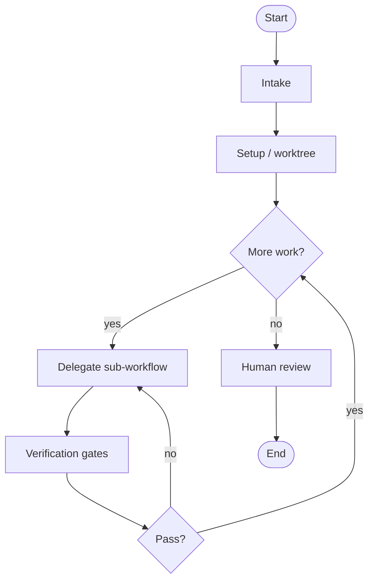
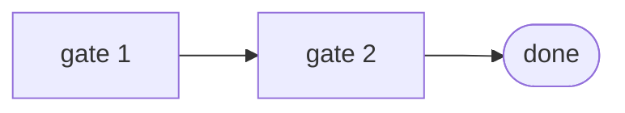

# Workflow diagrams — {ORCHESTRATOR_NAME}

> Template for HARNESS_DESIGN.md §14. implementer copies to `skills/{ORCHESTRATOR_NAME}/assets/workflow.mermaid.md`.

## Skill bundle

```mermaid
flowchart LR
  HD[designer] -->|HARNESS_DESIGN.md| HI[implementer]
  HI -->|creates| OR[{ORCHESTRATOR_NAME}]
  OR --> HV[validator]
  OR --> D1[{DELEGATE_1}]
  OR --> D2[{DELEGATE_2}]
```

## Orchestrator batch flow



## Verification gates (optional)


