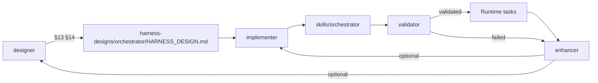

# Implementing a harness via skills (Cursor / agent CLIs)

A harness ships as **design doc + Mermaid + orchestrator skill**. In this repo: design under `harness-designs/<orchestrator>/`, runtime under `skills/<orchestrator>/`. See `harness-design-layout.md`.

## Five-skill pipeline

| Step | Skill | Artifacts |
|------|-------|-----------|
| 1. Design | `designer` | `harness-designs/<orchestrator>/HARNESS_DESIGN.md` (§1–§14) |
| 2. Implement | `implementer` | `skills/<orchestrator>/` incl. `assets/workflow.mermaid.md` |
| 3. Validate | `validator` | Smoke-run on one §3 item in a worktree + §7 gates + sign-off → `harness-designs/<orchestrator>/VALIDATION_REPORT.md` |
| 4. Run | `<orchestrator>` | User work in target repo |
| 5. Improve | `enhancer` | Meta and/or instance patches; optional re-run of steps 1–2 |

`skill-creator` is used **only inside** `implementer` (init, package).

## Designer vs implementer

| | designer | implementer |
|--|------------------|---------------------|
| Writes `skills/` | Never | Yes |
| Writes §14 | Yes (required) | Copies §14 → orchestrator; backfills if missing |
| Runs init_skill.py | Never | Yes |

Full handoff rules: `design-implementer-handoff.md`.

## Orchestrator skill contents (post-implementer)

1. `SKILL.md` — workflow + embedded batch Mermaid
2. `assets/workflow.mermaid.md` — full §14 canonical copy
3. `references/harness-spec.md`, `references/skill-delegation.md`
4. Repo templates from §12/§13 (`PLAN.template.md`, etc.)

## When orchestrator is not needed

§13 `rules-only` → implementer uses `implementer/references/rules-only.md`; no §14 in orchestrator (optional diagram in design only).

## Naming

- Orchestrator: `{domain}-{task}-harness` (e.g. `jet-p0-migration-harness`)
