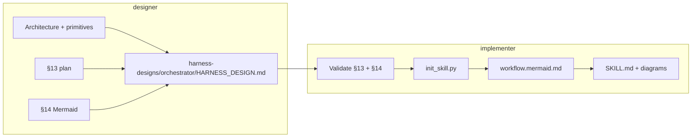

# Mermaid diagrams for harness design

§14 is **required** in every `HARNESS_DESIGN.md`. `implementer` materializes §14 into the orchestrator skill.

## Pipeline (design + implement)

## Required in HARNESS_DESIGN.md §14

Use `assets/workflow.mermaid.template.md` as a starting point.

### 1. Skill bundle (`flowchart LR`)

- `designer` → `implementer` → orchestrator → `validator` → each delegate from §6
- Label edges: `harness-designs/<name>/HARNESS_DESIGN.md`, `skills/<name>/`
- `validator` smoke-runs the orchestrator before runtime; on fail it routes to `enhancer`

### 2. Orchestrator batch flow (`flowchart TD`)

- Mirror §3 behaviors and §13 workflow graph
- Include decisions, delegate loads, gates, HITL, terminal PR/merge

### 3. Verification subflow (recommended)

- Sequential §7 gates as `flowchart LR`

## Syntax rules

- Use `flowchart TD` or `flowchart LR`; avoid deprecated `graph`
- Node IDs: alphanumeric + underscore only
- Labels with special chars: `NodeID["Display text"]`
- Decisions: `{question?}`; terminals: `([Label])`

## Implementer output mapping

| §14 content | Orchestrator path |
|-------------|-------------------|
| Full §14 copy | `assets/workflow.mermaid.md` |
| Batch flow block | Embedded in `SKILL.md` under `## Workflow diagrams` |
| Design path | Linked from `references/harness-spec.md` |

See `design-implementer-handoff.md` for validation checklist.
